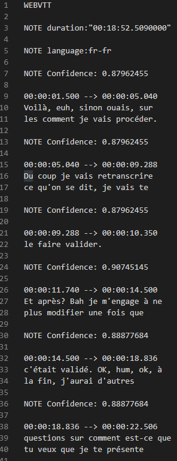
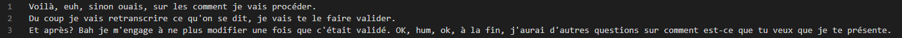

# VttToTxt

VTT is the extension file used by Microsoft in the 'Stream' product.
This script formats the VTT file into a plan TXT file : the TXT file will be located in the same directory as the vtt with the same name.

Usage : ``python VTTtoTXT.py myVTTPath.vtt``

Features :
-  Delete the timecode lines
-  Delete the metadatas (language, duration, format)
-  Rebuild sentences into unique line (remove added backline)

Before :

After :

